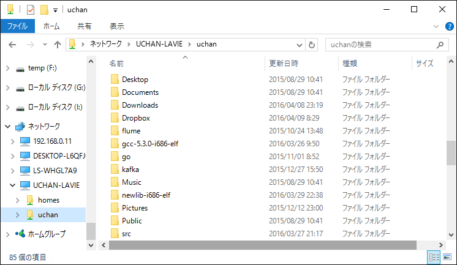

2016/04/07 by uchan

# Visual Studio Code で OS 開発をする

Visual Studio Code（以下 VSCode）は Microsoft が 2015 年 4 月にリリースした、ソースコード編集用のテキストエディタです。同社の有名な統合開発環境 Visual Studio は全部入りですが、VSCode はシンプルです。"Visual Studio" という名前ではありますが、Linux でも Mac OS X でも動きます。しかもオープンソースで開発されていて、最近の Microsoft の凄さを感じます。さらに、起動がとても軽いのにソースコードの補完機能を使えたりします。

ソースコードの補完機能というのは、変数名の一部を入力するだけで全体を補完してくれたり、構造体型の変数の直後で `.` や `->` を入力するとメンバの一覧を出してくれるような機能のことです。こんな機能があったらとても便利ではないでしょうか。VSCode でそれができますので（しかもとても快適に！）、試してみる価値はあるはずです。

## 対象読者

VSCode を使って補完を効かせながら OS のソースコードを書きたい方を対象とします。Linux の基本的なコマンドを知っていることを前提としています。Linux 上で VSCode を動かしたい方はもちろんですが、Windows 上の VSCode から Linux に置いてあるソースコードを編集したい方も対象です。

<!--more-->

## Linux 上で直接ソースコードを編集する方法

この記事では、まず Linux （記事の動作確認は Ubuntu 15.10 で行っています）に VSCode をセットアップし、補完を効かせながらコーディングするための設定を説明します。OS 開発に慣れてきて、いろいろな言語、いろいろなツールで開発しようとすると、やはり Linux を使いたくなってくると思います。その時に本記事が役に立つと思います。

そうはいっても Windows の完成度の高い GUI が使いたい、普段使いは Windows なので Windows から Linux を操作したい、というような筆者のような方も多いことでしょう。記事の後半では、Windows の VSCode から Linux に置いたソースコードを編集する方法を説明します。

### VSCode のセットアップ

VSCode をセットアップし、きちんと補完が効くように設定する手順を説明します。順に VSCode と Clang のセットアップ、VSCode へのプラグインのインストール、各種設定をやります。まずは VSCode のセットアップから。

公式のセットアップ手順が [Setting up Visual Studio Code](https://code.visualstudio.com/Docs/editor/setup) に載っています。Mac OS X、Linux、Windows それぞれの手順が書いてあるので読んでください。

参考までに、筆者が実行したコマンド列を紹介します。

    $ unzip ~/Downloads/VSCode-linux-x64-stable.zip
    $ sudo mv ~/Downloads/VSCode-linux-x64 /usr/local/
    $ sudo ln -s /usr/local/VSCode-linux-x64/code /usr/local/bin/vscode

手順書では VSCode のアーカイブをどこかに展開することになっています。迷ったら /usr/local に置けば良いでしょう。この手順を実行すると、好きなディレクトリで `vscode .` などと実行できるようになります。

### Clang のセットアップ

Clang は C/C++ 用のコンパイラです。といっても Clang で OS をビルドしよう！ということではなく、ソースコードの補完機能のために使うだけです（後で導入する VSCode の補完用プラグインが Clang を要求します）。OS 自体のビルドは、お好みのコンパイラでどうぞ。もちろん Clang を使ってもいいですよ。

Clang のセットアップは Ubuntu なら APT を使うだけなので簡単です。Windows での導入方法は後ほど説明します。

    $ sudo apt install clang-3.7

執筆時点で Ubuntu 15.01 の APT に登録されている最新版は clang-3.7 でした。基本的に新しいほど新しい言語規格に対応しているので、こだわりがなければ最新版を入れるといいでしょう。

### プラグインのインストール

いよいよソースコード補完のためのプラグイン "vscode-clang" をインストールします。VSCode を立ち上げて（code をダブルクリックするか、ターミナルで `vscode` と入力します）、Ctrl-P で Command Palette を表示させます。Command Palette で次のコマンドを実行すると vscode-clang をインストールできます。

    ext install vscode-clang

しばらくしてインストールが完了すると、有効にするために VSCode を再起動するか聞かれますので、再起動してください。

**コラム：ソースコード補完の技術**

C/C++ ソースコードを補完するための VSCode プラグインには、執筆時点で次の 3 つがあります。

1. C/C++ Clang (by Yasuaki MITANI)
2. ClangComplete (by kube)
3. C++ Intellisense (by austin)

1 と 2 はどちらも Clang を用いてソースコード補完を行うものです。3 は GNU Global を用いて補完を行います。

どちらの方法も、ソースコードを実行することなく静的に解析してソースコードの補完を行います。好みの問題かもしれませんが、筆者は Clang を使った補完をおすすめします。なぜなら Clang はもともとコンパイラであるため、GNU Global より高精度にソースコードを解析できるからです。今回は、Clang を使ったプラグインのうち、ダウンロード数の多い "C/C++ Clang" (vscode-clang) を使うことにしました。

Clang の他に有名な（Linux でよく使われる） C/C++ コンパイラには GCC があります。コンパイラとしては両者ほぼ同じように使えますが、Clang にはソースコードの解析情報を外部から取得しやすいという、GCC にない特徴があります。そのため、Clang はソースコード補完技術のバックエンドとしてよく使われます。

実はこれ以外に "C/C++" という、マイクロソフトが作っているプラグインがあります。試していませんので詳しくは分かりませんが、デバッグ機能などが充実しているようです。いかにもソースコード補完ができそうな気がしてきますが、残念ながら 2016/04/10 の時点ではソースコード補完機能はないようです。しかも、今のところ動作環境に対する制限が多く、簡単に動くのは Ubuntu 14.04 (x64) だけのようです。Windows に至ってはまったく対応していません。

### Clang コマンド名の設定

vscode-clang が Clang コマンドを見つけられるように設定します。VSCode の File > Preferences > User Settings を開き、次のように設定します（実際はセットアップした Clang のコマンド名に合わせてください）。

    {
        "clang.executable": "clang++-3.7"
    }

この設定が済んで VSCode を再起動させれば、とりあえずはソースコード補完ができるようになります。ただし、場合によってはきちんと補完ができません。それは、ソースコードからインクルードしているヘッダファイルを Clang が探せない場合です。

### インクルードパスの設定

システムの標準的な場所にインストールされているヘッダファイルや、相対パスで指定してあるヘッダファイルであれば、Clang が自動で探してくれます。しかし、自作 OS のビルド時に `-I` オプションなどでインクルードパスを追加している場合、そのパスを明示的に Clang に伝える必要があります。

その設定は VSCode の設定の `clang.cxxflags` で行えます。

この設定はワークスペースの設定ファイルに書くので、まずワークスペースを開きます。VSCode における「ワークスペース」は、あるディレクトリを指す言葉です。ワークスペースは普段仕事をする場所、みたいな意味合いがあります。VSCode を再起動しても、前回開いていたワークスペースは開かれたままになります。私は自作 OS のソースコードが置いてあるトップディレクトリをワークスペースとしました。

一旦ワークスペースとなるディレクトリを開いたら、VSCode の File > Preferences > Workspace Settings を開き、次のように設定します。（自作 OS 用のヘッダファイルが /home/uchan/bitnos/include にあるとします）

    {
        "clang.cxxflags": ["-I/home/uchan/bitnos/include"]
    }

ここまでで User Settings と Workspace Settings の 2 つの設定ファイルが登場しました。User Settings は $HOME/.config/Code/User/settings.json に、Workspace Settings はワークスペース直下の .vscode/settings.json に書かれます。

どちらにも同じ設定を書けますが、ワークスペースごとに変える必要のない設定は User Settings に、ワークスペース固有の設定は Workspace Settings に書くのが良いでしょう。Clang のコマンド名は自作 OS には関係ないので前者に、インクルードパスは自作 OS 専用なので後者に設定することにしました。

## Windows から Linux 上のソースコードを編集する方法

いよいよ Windows の VSCode から Linux 上のソースコードをいじる方法を説明します。やり方は大きく次の 2 つがあります。

- Windows から、Linux で動いている VSCode に接続して編集する
- Windows で動いている VSCode から Linux のファイルを編集する

前者は VNC などのリモートデスクトップ接続技術を使って Linux のデスクトップ画面を Window から見たり、X11 転送を用いて Linux 上のアプリケーションの画面描画だけを Windows でおこなったりして実現します。

後者は Samba を用いて Linux と Windows でファイルを共有することで実現します。この亜種として、Linux と Windows 双方から NAS を参照するという方法もあります。ただし、この方法はファイルが NAS に置かれてしまうため、Linux ノートを持って外出し、外出先でビルドする、というのができません。

VNC は手堅いですが、デスクトップ全体の画像データをやり取りするので重かったり、カクカクすることがあります。X11 転送はその画面の情報だけをやり取りするので比較的軽いですが、残念なことに筆者の環境では VSCode で X11 転送ができませんでした。ということで、筆者が職場でも実践している Samba を用いた方法を説明します。

### Samba のセットアップ

Samba はごく一般的なソフトウェアなのでパッケージになっているはずです。

    $ sudo apt install samba

ホームディレクトリを Windows と共有するための設定を書きます。

/etc/samba/smb.conf に次の設定を追加します。Ubuntu の場合、これらの設定はコメントアウトされている状態で書かれていることがあります。（`sudo gedit /etc/samba/smb.conf` とすれば設定ファイルを開けます）

    [homes]
       read only = no

設定を変えたら Samba をリスタートして、Windows から Samba に接続する際のアカウントを追加します。

    $ sudo service smbd restart
    $ sudo smbpasswd -a YOUR_NAME

リスタートとアカウント追加はどちらが先でも大丈夫なはずです。`smbpasswd` に指定した `-a` オプションは、ユーザがいなければ追加し、既にいればそのユーザのパスワードを変更する意味があります。

### Windows でディレクトリをマウント

今しがた共有設定をしたホームディレクトリを Windows でマウントします。エクスプローラを開いて次のアドレスをアドレスバーに入力します。

    \\HOST_NAME\YOUR_NAME

`HOST_NAME` は IP アドレスでも大丈夫です。

ホームディレクトリが開けたら、ディレクトリを右クリックし「ネットワーク ドライブの割り当て」を選択します。適当なドライブ文字を割り当てます。

ドライブ文字を付けなくてもファイルの読み書きはできますが、ドライブ文字を付けておくといろいろなツールから扱いやすくなります。開発ツールによっては直接ネットワーク上のディレクトリを見に行けないものもある（IntelliJ IDEA とか）ので、ドライブ文字を割り当てておくと便利です。

### Clang for windows の導入

Windows の VSCode で補完機能を使うには、Windows に Clang をインストールしなければなりません。

まず http://llvm.org/releases/download.html から "Clang for Windows (64-bit)" をダウンロードします。ビット数はお使いの OS のビット数に合わせれば良いですが、分からなければ 32-bit 版を使うとどちらの環境でも動くはずです。Clang のインストールとは全く関係ないですが、自作 OS で 64 ビット対応したら恰好良いでしょうねえ。どなたか記事をお願いします！（他力本願）

インストールは [LLVM Clang の Windows へのインストールと使い方 - プログラマーズ雑記帳](http://yohshiy.blog.fc2.com/blog-entry-294.html) あたりを参考にしてください。インストーラをクリックしていくだけです。ただし、記事によれば事前に Visual Studio （おそらく VSCode ではダメ）をインストールしておく必要があるようです。筆者のパソコンにはすでに Visual Studio 2015 がインストールされていたので、検証することはできませんでした。依存関係が自動で入らないのは、Ubuntu の APT に慣れてしまった筆者としては辛い世界です。

インストールの段階で clang コマンドを PATH に通しておくと、後から clang.executable の設定をしなくていいので楽です。インストールの途中で "for all users" か "for current user" を選択すると自動で PATH が通ります。ただ、もし PATH を通さなかったとしても VSCode のインストール後に User Settings へ次の設定を追加すれば問題ありません。

    "clang.executable": "C:\\Program Files\\LLVM\\bin\\clang++.exe"

### VSCode for windows の導入

例によって公式のセットアップ手順書 [Setting up Visual Studio Code](https://code.visualstudio.com/Docs/editor/setup) を参考にするとインストールできます。.NET Framework 4.5 が必要らしいので、Windows 7 ユーザの方は事前に導入しておきます。筆者は Windows 10 を使っているため、すでに導入されていました。

最後に Linux での作業と同じように、"vscode-clang" プラグインのインストールと Workspace Settings 内の `clang.cxxflags` の設定をやります。Workspace Settings をいじる前には、もちろんワークスペースを開いておく必要があります。先ほどネットワークドライブとして割り当てたホームディレクトリから、ワークスペースとなるディレクトリを探して開きます。（もし、ホームディレクトリより上位をワークスペースとする場合は、そこを共有できるように Samba の設定変更が必要です。）

Linux での作業と少し違うのは **Workspace Settings の設定ファイルが Linux と共有されている** 点です。ワークスペースの中の .vscode/settings.json は、先ほど Linux から設定したファイルと同じものなのです。したがって Workspace Settings を開くと、すでに `clang.cxxflags` の設定があるはずです。だから、設定はこんな感じになります。

    "clang.cxxflags": [
        "-I/home/uchan/bitnos/include",
        "-IZ:/bitnos/include"
    ]

設定を終えたら VSCode を再起動します。再起動後、無事に補完機能が使えているはずです。やったー！

